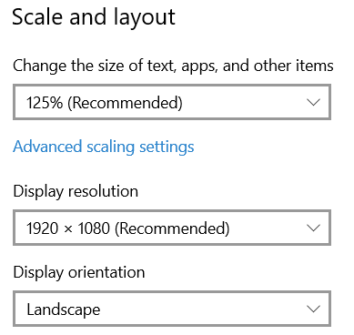
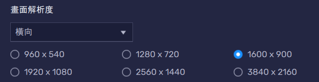

## What it Does
* Clear MomoTalk
* Clear Main Quest

## How To Download and run the code
1. Go to Upper right <>Code
2. Download Zip
3. Extract the zipped folder at anywhere
4. Execute the main.exe
5. Or Run main.py using pycharm

## Setup
### Only tested on Bluestack

